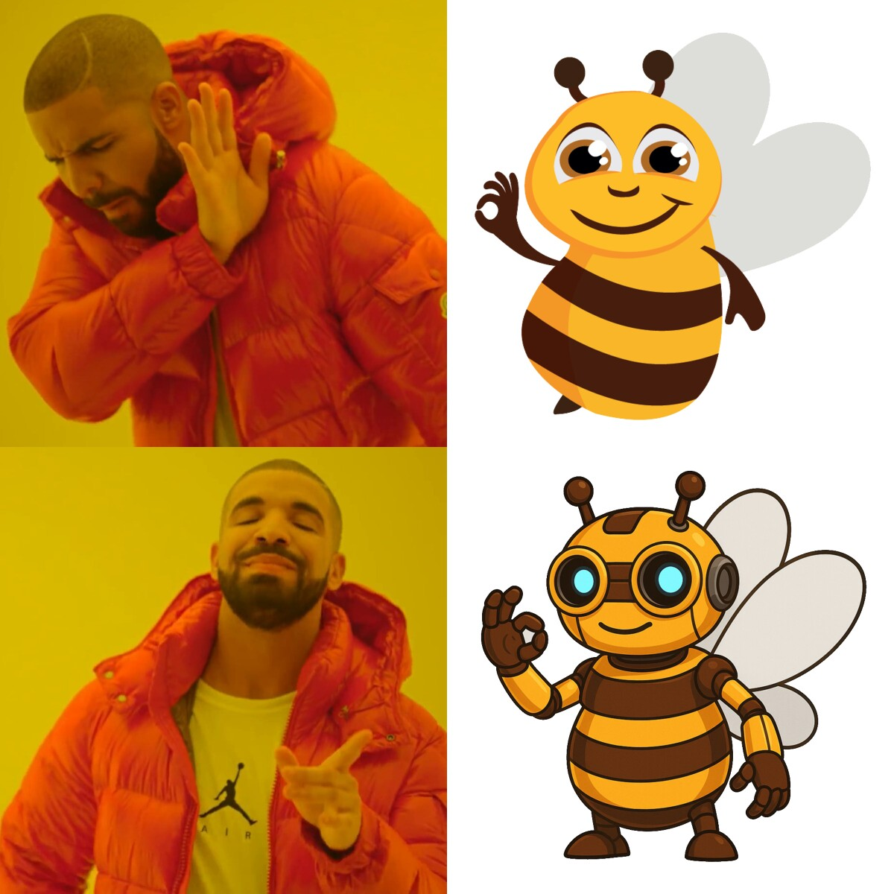
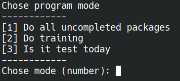
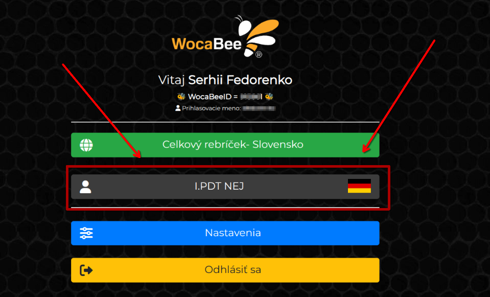
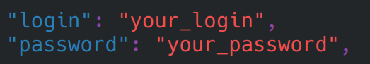
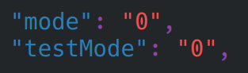

<h1 align="center">
  <br>
  </a>
  <br>
  WocaBot
  <br>
</h1>

<h4 align="center">Bot which will solve Wocabee for you.</h4>

<p align="center">
  <a href="#key-features">Key Features</a> •
  <a href="#how-to-use">How To Use</a> •
  <a href="#installation">Installation</a> •
  <a href="#license">License</a>
</p>



## Key Features

* Fully automated (except pexeso)
* Have modes:
  - Normal for packages
  - Training for points farming
  - And test for school (beta)
* Can solve
  - Word translation
  - Word completion
  - Word choosing
  - Finding pair
  - One out of many
  - Picture choosing
  - Picture description (only skip)
  - Words arranging (only skip)
  - And missing word
* Good readability and scalability of code
* CLI interface
* Cross-platform
  - Windows, macOS and Linux ready.
* I think it is enough. Who wants to do wocabee anyway? :D

## How To Use

### Start

To start bot you need to run `wocabot.py` file. You can do it by running command:
```bash
  python wocabot.py
```
Then select mode by writing number of mode you want to use:


> [!NOTE]
> You can set up default mode in `config.py` file.
>
> 0 - For choosing mode every time

Than browser window will open. You need to choose your class:



When you choose class, you need to click enter to start bot and continue with instructions.

---

### Modes overview
#### Mod 1

Normal mod which will do all uncompleted packages.\
It will automatically go through all packages and do all exercises(except pexeso).\

#### Mod 2
Training mod which will do wocabee training.\
It will start do training and will finis only when user stop it.
> [!WARNING]
> You need to click submit and exit than stop bot

> [!TIP]
> It`s the best way to farm wocapoints if you need to win some competition.

#### Mod 3

This mod is designed for school tests.\
And include 2 own submods:

**Semi-automatic**\
Will prepare answers for you and you need to click submit.

> [!TIP]
> Do some mistakes or wait for some time to not be suspicious.

**Automatic**\
Will do everything for you.

> [!CAUTION]
> Dont implemented yet.

## Installation

For all OS you need to have installed Google Chrome and python.

### Linux / MacOS
Use your package manager to install python-playwright.
```bash
  sudo pacman -S python-playwright
  sudo apt install python-playwright 
  ...
```
Than install chromium:
```bash
  playwright install --force chromium
```
Than clone repo or [download](https://www.dropbox.com/scl/fi/8lbv9g3wpzfwyu6bl81l2/WocaBot.tar.gz?rlkey=phzxgen4ym96dp07hdui33fak&st=kd2nbtd0&dl=0) archive
```bash
  git clone --branch relese --single-branch https://github.com/Serhij-coder/WocaBot.git
```
Final step is to <a href="#json-config">configure json</a>

Congratulation, you are ready to go.

### Windows
Clone repo or [download](https://www.dropbox.com/scl/fi/l57p408hfsjw2f6n4r6nl/WocaBot.zip?rlkey=vrw1tukztzth1htz3nvuq58b2&st=yhqoejr3&dl=0) archive
```bash
  git clone --branch relese --single-branch https://github.com/Serhij-coder/WocaBot.git
```
Than install python-playwright:
```commandline
  pip install playwright
```
And install chromium with npx:
```commandline
  sudo npx playwright install
```
Final step is to <a href="#json-config">configure json</a>

Congratulation, you are ready to go.

---

### Json config
Open `config.py` file and set your username and password.



> [!TIP]
> You can choose default mode (0 for choosing in program).
> 
> 

## License

GPL-3.0 License. See the [LICENSE](LICENSE) file for details.

